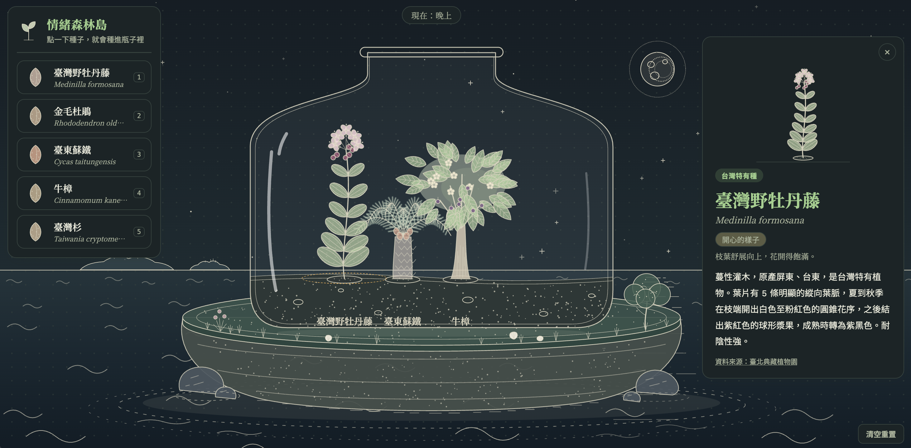

# 情緒森林島

一個放在海上小島的生態瓶：點一顆台灣特有種的種子種進瓶子，選一種心情，看它在 10 秒內長大，再點開閱讀它的介紹。純前端 DEMO，React + Vite，本機 localhost 即可展示。

## 玩法

1. 點左側的種子（或按鍵盤 `1`～`5`），種進生態瓶。
2. 選一種心情：開心、平靜、興奮、難過、生氣。
3. 植物依序長成 種子 → 發芽 → 小枝條 → 花或樹（約 10 秒）。
4. 點長好的植物，右側顯示介紹。可以同時種多顆（最多 6 顆），右下角「清空重置」按兩次即可清空。

## 特色

- **5 種植物 × 5 種心情 = 25 種樣子**：同一種植物會依心情改變姿態、花果數量與顏色，沒有壞結局。
- **背景隨當地時間變化**：清晨、早上、白天、黃昏、晚上，海與小島的顏色跟著切換。
- **植物圖鑑風格**：細線稿、點描、低彩度淡彩，全部以 SVG 繪製，沒有圖片素材。

## 植物

臺灣野牡丹藤、金毛杜鵑、臺東蘇鐵、牛樟、臺灣杉。資料整理自[臺北典藏植物園](https://www.future.url.tw/)。臺灣杉的特有性說法不一，畫面上會標示。

